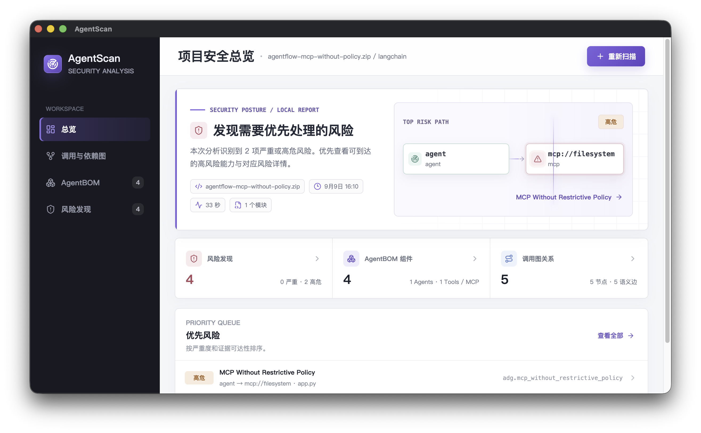
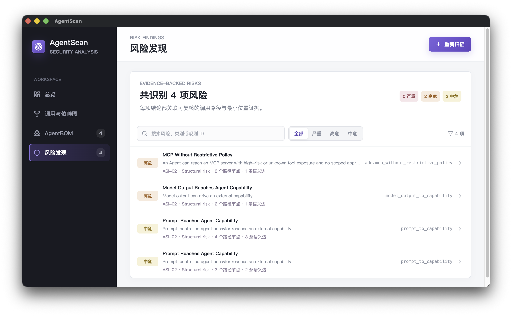
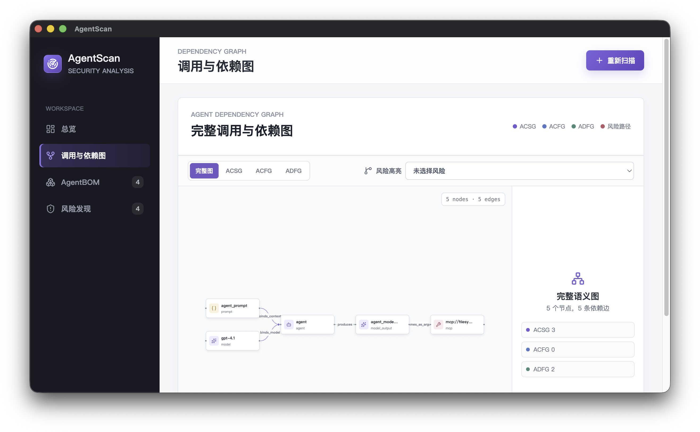
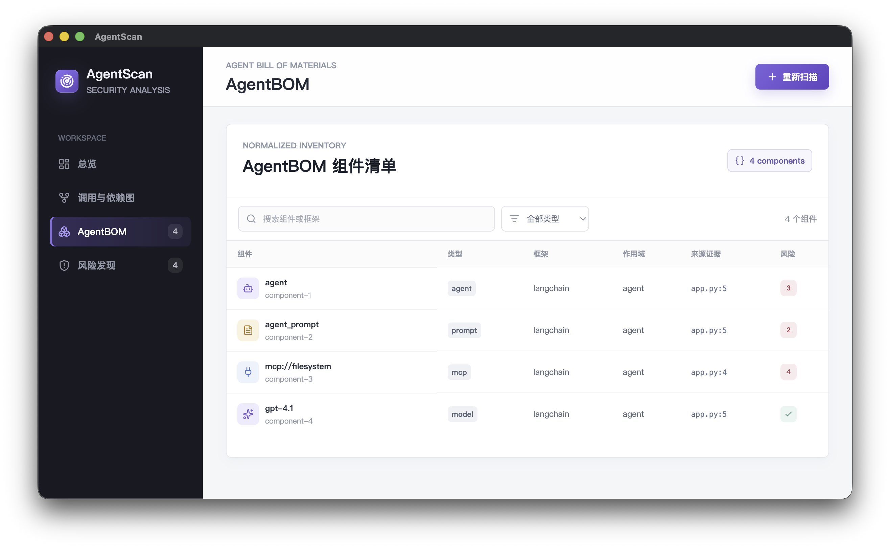

# AgentScan 使用文档

本文面向使用 AgentScan 检查项目的开发者与安全审查人员，按从安装、扫描到结果复核的顺序介绍桌面客户端，并提供 CLI 使用方法。

## 目录

- [欢迎使用 AgentScan](#欢迎使用-agentscan)
- [快速开始](#快速开始)
- [安装与启动](#安装与启动)
- [执行项目扫描](#执行项目扫描)
- [查看扫描结果](#查看扫描结果)
- [理解扫描结论](#理解扫描结论)
- [CLI 使用指南](#cli-使用指南)

## 欢迎使用 AgentScan

AgentScan 是面向 Agent 项目的本地静态安全分析工具。选择项目后，它会分析源码与受支持的配置，整理 Agent、模型、工具等组件及其关系，并生成带有风险原因、修复建议和位置证据的报告，帮助你判断哪些能力和调用路径需要进一步检查。

### 从这里开始

第一次使用，先阅读[快速开始](#快速开始)，了解完成一次扫描的最短流程。尚未安装时，按[安装与启动](#安装与启动)准备应用。

需要选择扫描方式，查看[执行项目扫描](#执行项目扫描)；已经拿到报告，继续阅读[查看扫描结果](#查看扫描结果)和[理解扫描结论](#理解扫描结论)。需要终端调用或保存 JSON 结果，直接进入 [CLI 使用指南](#cli-使用指南)。

### AgentScan 是什么

AgentScan 围绕一个明确选择的项目开展静态审查，将识别到的组件整理为 AgentBOM，将组件结构、控制流和数据流整理为调用与依赖图，并通过 Finding 展示需要复核的风险。它适合用于引入项目、代码交付和修复后的复查。

AgentScan 按选定项目开展本地静态分析，不要求运行目标代码、安装目标依赖、启动 Agent 或 MCP Server，也不通过连接项目配置中的模型或工具端点来验证行为。公开 Git 输入的获取过程需要联网；源码环境首次准备运行时也需要下载依赖。

### 使用 AgentScan 能做什么

你可以在引入、交付或修改 Agent 项目时使用 AgentScan，重点检查以下问题：

| 检查目标 | 报告可以帮助你了解的内容 |
| --- | --- |
| 梳理项目组成 | 识别到哪些 Agent、工作流、模型、工具、MCP 及安全控制组件 |
| 理解调用与数据流 | 组件如何关联，输入、模型结果与工具调用之间存在什么静态路径 |
| 检查高权限能力 | 命令执行、文件访问等能力是否缺少可识别的审批、隔离或策略约束 |
| 检查提示与状态风险 | 不可信输入是否进入系统提示、持久记忆或其他敏感环节 |
| 检查 MCP 配置 | 包版本、凭据、目录范围、传输方式和工具过滤等配置是否存在风险 |
| 定位和复核问题 | 从 Finding 查看规则、原因和位置证据，再到调用图检查上下游关系 |

### 产品版本

#### 桌面客户端

桌面客户端是主要使用入口，提供本地目录、ZIP 归档和公开 Git 三种输入方式。扫描完成后，可以在“总览”“调用与依赖图”“AgentBOM”“风险发现”之间切换，查看项目结构和风险证据。

#### CLI

CLI 面向终端和自动化脚本，使用与桌面相同的分析核心，输出结构化 JSON。目前采用从源码构建的使用方式，没有独立发布的 npm CLI 安装包；在受支持的 macOS 和 Linux 源码环境中均可使用。

### 版本说明

AgentScan 的发布仓库目前为私有仓库。具有仓库访问权限的用户可登录 GitHub 后访问 [Releases](https://github.com/aicensus-labs/AgentScan/releases)。没有访问权限时，页面可能返回 404，需要向项目维护者获取访问权限或安装包。

各平台已发布的安装包如下：

| 系统与架构 | 可用版本 | 安装文件 |
| --- | --- | --- |
| macOS Apple Silicon / arm64 | [v0.1.3](https://github.com/aicensus-labs/AgentScan/releases/tag/v0.1.3) | `AgentScan-0.1.3-mac-arm64.dmg` 或 `.zip` |
| Linux x64 | [v0.1.6](https://github.com/aicensus-labs/AgentScan/releases/tag/v0.1.6) | `AgentScan-0.1.6-linux-amd64.deb` 或 `AgentScan-0.1.6-linux-x86_64.AppImage` |
| macOS Intel / x64 | 暂无已发布安装包 | 可参考源码启动方式 |
| Windows、Linux arm64 | 当前不支持 | 暂无对应分析运行时安装包 |

仓库标记为 Latest 的 v0.1.6 当前只提供 Linux x64 安装包。macOS 用户应进入 v0.1.3 页面选择 arm64 资产。

安装包内置分析运行时，安装用户无需另行安装 Python、Node.js、Git、YASA 或被扫描项目的依赖。

### 更多资源

具有仓库权限的用户可通过以下入口获取安装包、源码和支持：

- [下载与发布说明](https://github.com/aicensus-labs/AgentScan/releases)
- [AgentScan 源码仓库](https://github.com/aicensus-labs/AgentScan)
- [问题反馈](https://github.com/aicensus-labs/AgentScan/issues)

反馈时建议提供应用版本、操作系统与 CPU 架构、使用的输入方式、复现步骤、错误码及脱敏后的诊断。若可以提供最小复现项目，应先移除凭据、个人信息和不必要的业务代码。

## 快速开始

安装步骤参考[安装与启动](#安装与启动)。以下步骤以桌面客户端扫描本地项目为例。

第一次使用时，建议选择一个结构清晰、包含 Python Agent 源码的本地项目。

1. 启动 AgentScan，进入左侧“总览”。
2. 选择“本地目录”，点击“选择项目目录”。
3. 在系统文件选择器中选择项目根目录，确认页面显示的项目名称。需要更换时，点击“重新选择”。
4. 点击“开始扫描”。
5. 等待总览中的阶段提示和进度条完成，随后查看生成的报告。
6. 若有风险发现，打开一项 Finding，阅读结论和位置证据，再点击“在调用图中定位”检查关联路径；没有 Finding 时，可继续查看 AgentBOM 和调用图，并留意分析诊断。

首次扫描完成前，“调用与依赖图”“AgentBOM”和“风险发现”入口不可用。项目输入通过点击系统选择器完成，当前没有拖放导入操作。

报告生成后，可按“总览 → 风险发现 → 风险详情 → 调用与依赖图”继续复核。三种输入的具体要求见[执行项目扫描](#执行项目扫描)，各项结果的含义见[理解扫描结论](#理解扫描结论)。

## 安装与启动

先根据[版本说明](#版本说明)选择与你的系统和 CPU 架构匹配的安装包。使用安装包时无需准备开发环境；需要源码运行或 CLI 时，再按本章的源码步骤准备。

### 登录与访问权限

AgentScan 当前的本地扫描流程没有产品账号登录步骤。获取私有 GitHub 仓库中的安装包或源码时，需要登录具有仓库访问权限的 GitHub 账号；该账号不会作为扫描“公开 Git”项目的凭据。

### macOS 安装

1. 从 v0.1.3 页面下载 DMG 或 ZIP。
2. 使用 DMG 时，打开镜像，将 `AgentScan.app` 复制到“应用程序”；使用 ZIP 时，解压后将应用移至“应用程序”。
3. 启动 AgentScan，进入“总览”。

当前 macOS 安装包采用 ad-hoc 签名，没有 Apple Developer ID 签名或公证，首次打开可能受到 macOS 安全策略限制。遇到拦截时，先核对下载来源、校验值和发布说明；受组织管理的设备应按组织的软件安装流程处理。

如果启动 AgentScan 时遇到错误提示“'AgentScan.app' 已损坏，无法打开。您应该将它移到废纸篓。”这是由于 MacOS 系统的特性，通过浏览器、社交软件等其他地方下载的软件，系统会自动添加 com.apple.quarantine 扩展属性，表示这个软件不是从 App Store 下载的。在终端执行以下命令再尝试启动。

```bash
sudo xattr -rd com.apple.quarantine /Applications/AgentScan.app
```

### Linux 安装

下载 v0.1.6 中与你的安装方式对应的文件。

在支持 DEB 的系统中安装：

```bash
sudo apt install ./AgentScan-0.1.6-linux-amd64.deb
```

也可以使用 AppImage：

```bash
chmod +x AgentScan-0.1.6-linux-x86_64.AppImage
./AgentScan-0.1.6-linux-x86_64.AppImage
```

### 从源码启动

需要源码运行或使用 CLI 时，准备 Node.js 22 及以上、npm、Python 3.12 及以上（含 pip）、Git，以及下载固定版本分析运行时所需的网络。源码运行支持 macOS arm64/x64 和 Linux x64。

取得有权访问的 AgentScan 源码后，在 **AgentScan 仓库根目录**执行：

```bash
npm ci
npm run runtime:setup
npm run dev
```

`runtime:setup` 会准备 `.agentscan-runtime` 并检查运行时是否就绪；`npm run dev` 会启动 Electron 桌面应用。请在该应用窗口中操作，单独打开开发服务器网页无法使用系统文件选择器和桌面扫描接口。

如果机器上有多个 Python，可在运行上述命令前指定 Python 3.12 或更新版本的解释器：

```bash
export AGENTSCAN_PYTHON="/absolute/path/to/python3.12"
```

这里安装的是 AgentScan 自身的依赖。扫描项目不要求先安装或运行目标项目的依赖。

### 启动后无法选择文件

文件选择器依赖 Electron 桌面客户端。如果只打开开发服务器网页，会看到“系统文件选择器仅在桌面客户端中可用”等提示。安装用户应启动 AgentScan 应用；源码用户应运行 `npm run dev` 并在它启动的应用窗口中操作。

## 执行项目扫描

在“总览”中选择输入方式，每次分析一个项目。已有报告时，点击“重新扫描”打开输入选择。

| 输入方式 | 适用情况 |
| --- | --- |
| 本地目录 | 开发中的项目、已取得的源码副本或本地私有仓库 |
| ZIP 归档 | 收到的项目压缩包或下载的源码归档 |
| 公开 Git | 无需登录即可读取的 HTTPS Git 仓库 |

### 扫描本地目录

适合扫描正在开发的项目、已经取得的代码副本，或本地保存的私有仓库。

在“本地目录”中点击“选择项目目录”，选择包含相关源码和配置的项目根目录，再开始扫描。无需启动项目、配置模型服务或运行 MCP Server。

如果只选择某个子目录，目录外的源码和配置不在本次输入范围内，可能影响关系恢复和风险判断。应按本次审查目标选择完整项目，或边界明确的独立子项目。

### 扫描 ZIP 归档

适合扫描收到的项目压缩包或下载的源码归档。

选择“ZIP 归档”，点击“选择 ZIP 归档”，从系统选择器中选择 `.zip` 文件，再点击“开始扫描”。AgentScan 会将内容解压到自己的临时目录，分析结束后清理临时内容；原始 ZIP 文件保留。

归档必须采用受支持的 ZIP 格式。加密条目、危险路径、重复或大小写冲突路径、符号链接、特殊文件，以及不受支持的压缩方式会被拒绝。

### 扫描公开 Git 仓库

适合扫描无需登录即可读取的公开 Git 仓库。

选择“公开 Git”，在“公开仓库 URL”中填写仓库的 HTTPS 克隆地址，例如 `https://github.com/owner/repository.git`，再点击“开始扫描”，等待下载和分析完成。

输入应为仓库地址，不要使用文件页面、分支浏览页面，或带用户名、密码、令牌、查询参数和片段的 URL。当前不支持 SSH、私有仓库凭据、内网仓库地址或非默认 HTTPS 端口。

AgentScan 获取默认分支的浅克隆，记录实际解析的提交，随后在临时目录中分析。当前没有分支、标签或提交选择控件；需要检查指定版本时，可先自行取得该版本，再使用“本地目录”。

包含 Git 子模块条目的仓库会被拒绝；Git LFS 对象不会被自动获取。需要这些内容时，应先准备适合静态分析的本地项目副本。

公开 Git 导入会访问仓库服务。网络请求超时或部分临时服务故障时，程序最多自动重试一次；认证失败、无效输入等错误不会通过反复重试解决。

### 查看进度与取消扫描

扫描依次经历输入准备、文件索引、Python 源码解析、调用关系与数据流分析、组件和图构建、安全规则检查、报告生成等阶段。界面显示当前阶段、百分比和进度条。

百分比按分析阶段推进，复杂项目在调用关系与数据流分析阶段停留较久。

需要中止时，点击“取消扫描”。出现“正在取消”或清理提示后，等待分析进程停止和临时内容清理完成，再发起新的扫描。

### 重新扫描

报告生成后，点击右上角“重新扫描”，重新选择目录、ZIP 或公开 Git 地址，再点击“开始扫描”。

新扫描成功前，上一份报告仍保留；扫描失败或取消时也不会替换它。查看结果时，应确认当前展示的是新报告还是标记为“上一次报告”的旧结果。当前客户端一次运行一个扫描任务。

### ZIP 与 Git 导入限制

以下是当前导入阶段的固定限制，界面没有调整入口：

| 项目 | 上限 |
| --- | ---: |
| ZIP 文件体积 | 256 MiB |
| Git 下载响应累计大小 | 128 MiB |
| 解压或检出的内容大小 | 512 MiB |
| 单个文件大小 | 64 MiB |
| 文件与目录条目数量 | 20,000 |
| 路径深度 | 40 层 |
| Git 单次网络请求时间 | 90 秒 |

超过导入限制时，按错误提示检查大型数据、构建产物等内容，准备范围明确的项目副本后重试。

### 扫描问题处理

#### 公开 Git 导入失败

先确认链接是无需登录即可访问的 HTTPS 仓库地址，并检查网络连接。浏览器已登录时能打开某个私有仓库，不代表 AgentScan 的匿名获取方式也能访问它。

带凭据或查询参数的地址、SSH 地址、内网地址、包含子模块的仓库，以及超过导入限制的内容都会被拒绝。私有项目可在取得授权的本地副本后使用“本地目录”扫描。

#### ZIP 被拒绝

根据错误提示检查归档是否加密、格式是否受支持、是否包含符号链接或冲突路径，以及文件大小和条目数是否超限。可以从可信项目副本重新生成普通 ZIP，再次导入。

#### 获取或分析失败

桌面会在总览显示失败提示与错误信息；CLI 提供结构化错误码。常见对应关系如下：

| 错误码 | 排查方式 |
| --- | --- |
| `invalid_target` | 确认目标存在、可读取，并重新通过系统选择器选择目录或文件；Git 输入检查地址格式 |
| `acquisition_failed` | 检查 ZIP 内容、Git 可访问性和获取过程诊断 |
| `acquisition_limit` | 检查导入大小、条目数和路径深度，准备范围更明确的输入 |
| `engine_unavailable` | 安装版重新校验或安装对应平台的完整安装包；源码版运行 `doctor` 并检查运行时 |
| `analysis_failed` / `invalid_result` | 保存错误码与脱敏诊断，准备最小复现输入后反馈 |
| `analysis_timeout` | 默认分析时间上限为 10 分钟；缩小为边界完整的子项目，或提交可复现问题 |
| `scan_busy` | 等待当前扫描完成或取消清理完成，再启动下一次扫描 |
| `scan_cancelled` | 本次扫描已取消，可重新选择目标发起扫描 |

源码版运行时未就绪时，可执行 `npm run runtime:setup` 重新准备。当前桌面与 CLI 均没有公开的分析超时调整选项。

### 临时内容与清理

ZIP/Git 的获取目录和分析临时结果由 AgentScan 管理，在成功、失败、超时或取消后清理；本地原项目和原始 ZIP 不作为临时内容删除。用户自行保存的 CLI JSON 由用户管理。

## 查看扫描结果

扫描成功后，左侧导航提供四个报告页面。本章介绍查看、筛选与定位操作；风险等级和证据含义见[理解扫描结论](#理解扫描结论)。

### 总览

总览显示项目名称、报告时间、分析耗时、模块数，以及风险发现数、AgentBOM 组件数、图节点和语义边数量。点击对应摘要卡片可进入详细页面。

“优先风险”展示部分严重或高危问题；点击“查看全部”可以进入完整风险列表。总览中的风险路径是快速入口，完整路径应在详情或调用图中查看。



### 风险发现与详情

进入“风险发现”后，可以搜索风险标题、类别或规则 ID，也可以通过“全部”“严重”“高危”“中危”筛选。低危项在“全部”中查看。

点击任意 Finding 打开风险详情，查看结论、风险原因、修复建议、可达路径，以及位置与语义证据。需要检查关系时，点击“在调用图中定位”；按 Esc 或点击关闭按钮可退出详情。



### 调用与依赖图

在风险详情中点击“在调用图中定位”，应用会切换到“调用与依赖图”，高亮当前 Finding 对应的节点和边，并保留周围关系供你检查。

图上方可切换四种视图：

| 视图 | 主要用途 |
| --- | --- |
| 完整图 | 综合查看本次分析生成的语义节点和关系 |
| ACSG | 查看组件结构关系 |
| ACFG | 查看控制流关系 |
| ADFG | 查看数据流关系 |

使用“风险高亮”下拉框可以切换要追踪的 Finding；点击“清除风险高亮”恢复一般浏览，点击“完整证据”回到该风险的详情。

点击节点可查看名称、类型、框架和证据；点击边可查看起点、终点、关系类型与证据。通过画布平移、缩放控件和缩略图浏览较大的图。该页面用于阅读分析结果，不支持编辑图关系或拖动节点改变布局。



### AgentBOM

AgentBOM 是本次分析识别到的 Agent 相关组件清单。进入页面后，可以按组件名或框架搜索，并按报告中实际出现的组件类型筛选。

列表展示组件、类型、框架、作用域、来源证据和关联风险数量。它适合回答“这个项目使用了哪些能力”“某项能力来自哪里”等问题。



### 报告留存与分享

当前桌面报告仅保存在运行中的内存里，没有保存、导出或历史记录功能。需要留存时，使用 CLI 并将 JSON 重定向到文件。关闭或重新启动应用后，不会自动恢复上一份报告。

CLI 保存方法见[保存和处理 JSON](#保存和处理-json)。当前桌面不支持导入保存的 JSON 并恢复为历史报告。

进入桌面或 CLI 的分析输出经过字段筛选和脱敏，主要保留解释发现所需的最小位置与语义证据。向他人分享报告或问题复现材料前，仍应检查其中的业务名称、路径和其他不宜公开的信息。

### 当前页面入口

当前桌面入口为“总览”“调用与依赖图”“AgentBOM”“风险发现”。证据放在 Finding 详情中，覆盖相关元数据可通过 CLI 查看。

## 理解扫描结论

复核报告时，需要同时看风险等级、静态证据、分析范围和诊断信息。扫描流程成功与项目没有风险，是两个不同的判断。

### 一项 Finding 表示什么

这些结果来自静态规则和语义分析。发现一条风险路径，表示存在需要复核的源码或结构证据，不表示 AgentScan 已经运行攻击并验证了利用效果。

每项 Finding 的详情可按以下顺序阅读：

| 内容 | 阅读方式 |
| --- | --- |
| 严重度 | 确定复核和处理的优先级，分为严重、高危、中危、低危 |
| 规则与分类 | 查看规则 ID；有映射时同时显示 OWASP Agentic、CWE 标识 |
| 结论 | 了解本次发现指向的问题 |
| 风险原因 | 判断为什么当前关系或能力组合可能产生风险 |
| 修复建议 | 结合项目实际控制措施评估如何修改；有建议时显示 |
| 可达路径 | 按顺序查看起点、中间节点、目标，以及已提供的语义边 |
| 位置与语义证据 | 根据文件路径、行号和摘要，在自己的代码编辑器中复核 |

### 严重度与证据类别

严重度分为严重、高危、中危、低危，用于安排处理顺序。优先复核严重或高危项，再结合项目的能力边界与使用场景处理其他发现。

证据类别说明本次结论依据什么信息得出：

| 标签 | 含义 |
| --- | --- |
| 已确认数据流 | 静态分析识别到了相关数据流证据 |
| 结构性风险 | 组件关系或能力组合符合风险规则 |
| 缺少安全控制 | 在当前可识别范围内未找到所需控制证据 |
| 静态分析证据 | 使用其他静态证据支持结论 |

### 可达路径与位置证据

可达路径用于追踪风险涉及的起点、中间节点和目标，语义边说明节点之间的关系。路径来自静态分析，应结合源码检查实际调用条件。

“位置与语义证据”提供最小定位信息和语义摘要，无法阅读完整源码。部分 Finding 没有独立源码位置，此时仍可检查其规则与图路径。

### 根据结果修复并复查

1. 优先选择严重或高危 Finding，确认规则和风险原因。
2. 根据位置证据找到源码，结合图路径检查输入来源、能力边界及已有控制措施。
3. 在自己的开发环境中修改项目，或记录需要进一步确认的上下文。
4. 回到 AgentScan，重新选择修复后的项目并扫描。
5. 复核原问题对应的路径与规则，同时确认本次分析是否完整、是否出现其他 Finding。

AgentScan 当前不自动修改目标项目，也没有风险忽略、审批流或历史报告对比界面。若要保留前后结果，可使用[CLI JSON 输出](#保存和处理-json)。

## CLI 使用指南

CLI 使用与桌面相同的分析核心，适合终端调用和自行编写自动化脚本。当前没有独立发布的 npm CLI 安装包；本节采用从源码构建的方式。

### 准备与诊断

按“从源码启动”一节完成 `npm ci` 和 `npm run runtime:setup` 后，在 AgentScan 仓库根目录执行：

```bash
npm run build:node
node dist/cli/index.js doctor
```

`doctor` 检查分析运行时。输出 `Ready: yes` 后再发起扫描；需要机器可读结果时使用：

```bash
node dist/cli/index.js doctor --json
```

### 扫描目录、ZIP 和公开 Git

以下路径和仓库地址为格式示例，请替换为实际目标：

```bash
node dist/cli/index.js scan "/absolute/path/to/project"
node dist/cli/index.js scan-zip "/absolute/path/to/project.zip"
node dist/cli/index.js scan-git "https://github.com/owner/repository.git"
```

每条扫描命令接受一个目标参数，输出 JSON 到标准输出。需要取消时按 `Ctrl+C`，等待取消响应和临时清理完成。

### 保存和处理 JSON

使用终端重定向可以保存 CLI 响应：

```bash
node dist/cli/index.js scan "/absolute/path/to/project" > scan-result.json
```

响应通过 `ok` 区分成功与失败：成功时读取 `report`，失败时读取 `error.code`、`error.message` 和 `error.diagnostics`。保存的文件也可能是失败响应，处理前应先判断 `ok`。

成功报告中的主要字段包括：

| 字段 | 用途 |
| --- | --- |
| `report.findings` | 风险发现、严重度、规则、原因、修复建议和证据 |
| `report.components` | AgentBOM 组件清单 |
| `report.graphNodes` / `report.graphEdges` | 图节点与语义边 |
| `report.origin` | 输入类型和标签；ZIP/Git 输入还可包含摘要或提交信息 |
| `report.diagnostics` | 分析诊断与需要关注的未处理情况 |
| `report.coverageFiles` | 分析覆盖相关元数据，不应作为完整代码覆盖率或安全评分 |
| `report.provenance` | 适配器、分析引擎、结构版本和分析模式信息 |

JSON 保存由调用者的终端完成，不是桌面客户端的报告导出功能。当前桌面也不支持将该文件导入并恢复为历史报告。

### 退出码

| 退出码 | 含义 |
| --- | --- |
| `0` | 扫描成功，或 `doctor` 检查就绪 |
| `1` | 获取或分析失败，或 `doctor` 检查未就绪 |
| `2` | 命令或参数不合法 |
| `130` | 扫描被 `Ctrl+C` 取消 |
